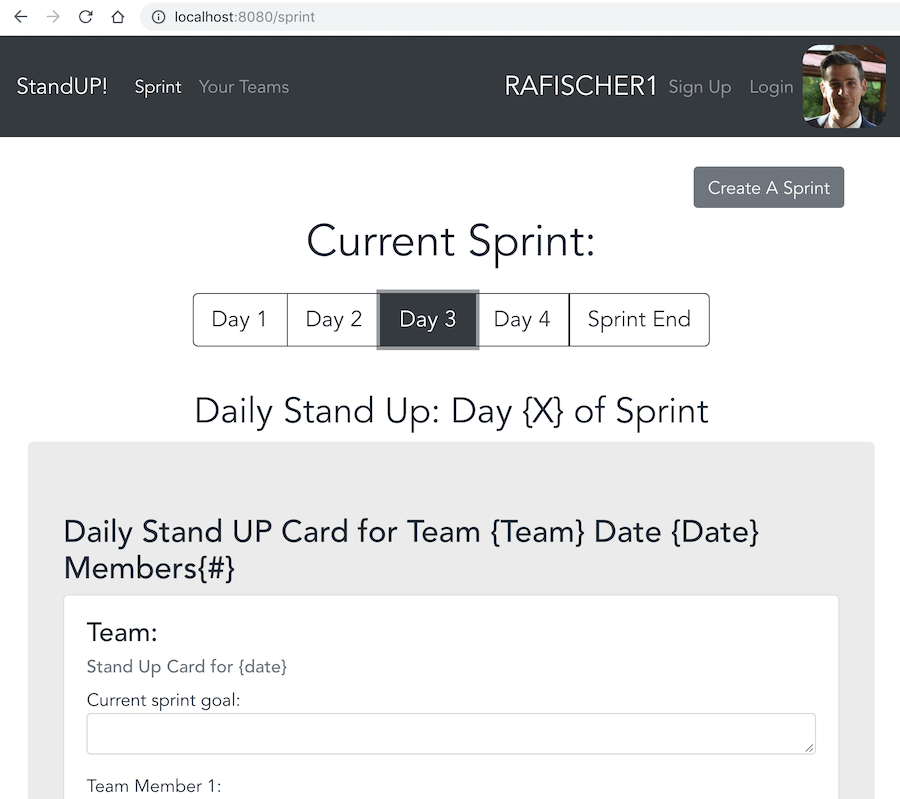

# ☃️ Stand Up Routes / Style Guide / Bootstrap Cheats ⛄️

## routes

  `/teams_users`

   * getAllTeams - every team, every user

   * addUserToATeam - teamId and userId weak table

   * Delete user from team

   `/user_teams/${id}` - get all teams for given user

   `/new_member/${name}` - join a team route call for profile

   `/sprints/${team_id}` post a sprint route

   `teams_users/` jwt and body = {teamName}

   `standUps/${sprint_id}` POST a standup to the sprint w/ given id body = {user_id}

## To-do list

## Artie Portfolio To Do List 🏄‍

#### Creating a new sprint when creating a new team to populate sprint page

[x] Place `created` functions into `mounted` lifecycle hooks

[x] Move create sprint to profile page on new team create and get a 200 response

[ ] Pass created sprint and sprint goal to Sprint page with redirect and props

[x] General clean up and airBnB linting on stores

[ ] auto generate length of sprint on sprint page: `SprintInfo.sprint_length`

#### Sprint page edits

[ ] open sprint pages for multiple days

[ ] populate sprint card if a new member joins

[ ] post and edit a sprint card

[ ] organize the storage of current sprint info coming in from sprint store 🏬

[ ] utilize the autogenerated gravatars for member images [Gravatar Site](https://en.gravatar.com/site/implement/)

#### Stretch Goals

[ ] dark mode / different color modes 

---

### Monday

[x] get id on teams list and link to /sprint page with information

[ ] when a team is selected and no sprints exist a check is made for an empty array and a modal appears to "Create a sprint"

[x] add a Create a sprint button on the sprint page

[ ] Post a sprint to `/sprints/${team_id}`

[ ] populate standup cards

[x] [Spin Kit Spinners](https://github.com/TonPC64/vue-spinkit)

[x] delete a team button

[x] capitalize team names back from db

[ ] tab through sprint days to load standUp components [link to Vue docs - tabs](https://vuejs.org/v2/guide/components-dynamic-async.html)

[x] "logout" view toggling for signup/sign in and replace img to default 

[x] join a team

---
## Stretch goals

### bootstrap color themes

> a select field on the Sprint View page that can toggle bootstrap themes for any view

[ ] default: dark, outline dark, accent: light, outline-light

[ ] "evening": info, text-dark, text-secondary,

[ ] "dark mode": text-white bg-dark secondary: danger

[ ] team names capitalize each word in string

[x] make Footer a component rendered in App instead of just a class

[ ] "team name" input in profile still needs an error catch "on submit" for a team name that is < 4

[x] error message handling for profile page

### Info Popovers

on SignUp/Welcome page use [Popover Messages](https://bootstrap-vue.js.org/docs/components/popover) to display more info on Scrum/Agile philosophy

---

